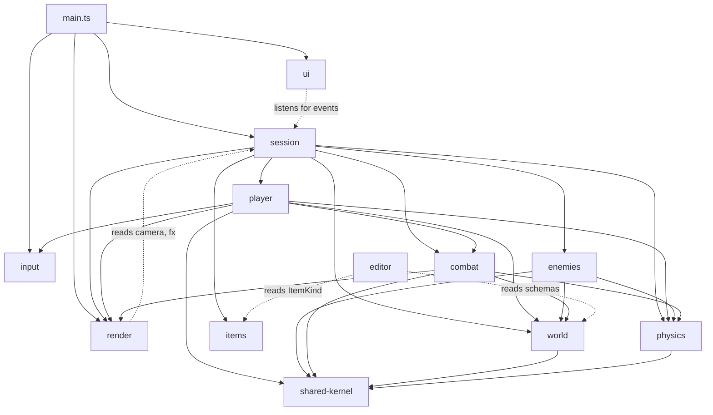

# Topology

How the codebase is shaped, what the contexts own, and how control flows
through a frame.

## Bounded contexts

Twelve contexts, each a folder under `src/`:

| Context | Purpose |
|---|---|
| **session** | Game loop, lifecycle, level sequencing, EventBus |
| **player** | Player entity + behavior + instability state |
| **enemies** | Non-player actors (prowler, dummy) |
| **combat** | Bullets, weapons, ruptures (the damage event) |
| **world** | Level data, destruction, kinetic platforms, materials |
| **items** | Pickups |
| **physics** | Collision pipeline + SAT |
| **input** | Keyboard mapping + edge detection |
| **render** | Pixi rendering, camera, fx (visual feedback) |
| **editor** | Standalone level-editor app |
| **ui** | HTML overlays for the running game |
| **shared-kernel** | True cross-context primitives (vec2, polygon) |

Each context has its own `CONTEXT.md` — read those for the details on what
each owns and explicitly does NOT own.

`src/main.ts` and `src/config.ts` stay at the repo root. `main.ts` is the
Vite entry point (composition root). `config.ts` is consumed by every
context and would create cycles if homed in any one.

## Dependency rule

```
              ┌─────────────────────┐
              │       session       │  (orchestrates)
              └──┬──────────────┬───┘
                 │              │
    ┌────────────┘              └─────────────┐
    ▼                                         ▼
┌────────┐  ┌─────────┐  ┌─────────┐    ┌──────────┐
│ player │  │ enemies │  │  combat │    │  render  │
└──┬─────┘  └────┬────┘  └────┬────┘    └────┬─────┘
   │             │            │              │
   └──────┬──────┴────────┬───┴────┬─────────┘
          ▼               ▼        ▼
      ┌────────┐    ┌────────┐  ┌──────────────┐
      │ world  │    │ input  │  │ shared-kernel│
      └────┬───┘    └────────┘  └──────────────┘
           ▼
       ┌────────┐
       │physics │
       └────────┘
```

**Allowed:** any context may depend on `shared-kernel`. Domain contexts
(player, enemies, combat, world, items) may depend on `physics`. `session`
depends on most things — it's the orchestrator.

**Forbidden:** circular dependencies. `world` does not depend on `combat`
or `player` (combat/player consume world, not the other way around).
`shared-kernel` depends on nothing (only Pixi-free primitives).

**Crossings of note:**
- `session/game.ts` imports `consumeHitstopTick` from `render/fx` — this
  is the awkward one called out in [ADR-0003](adr/0003-keep-fx-as-one-file.md).
  Hitstop is in render because the rest of FxState is visual; gating
  the loop from there is the trade-off.
- `editor/` and `ui/` are leaf contexts: nothing else depends on them.
- `render/index.ts` is the largest single file because it's the scene
  composition orchestrator. Per [ADR-0002](adr/0002-keep-cohesive-multi-section-files.md),
  splitting it would just shuffle the orchestrator elsewhere.

## Context relationships (Mermaid)



Solid arrows = direct import dependency.
Dotted arrows = read-only / event-listening relationships (no compile-time coupling beyond the typed event payloads).

## Cross-boundary events

All events flow through `session/eventBus.ts` (typed in-process emitter).
Payload shapes are defined in `EngineEvents`.

| Event | Emitted by | Consumed by | Purpose |
|---|---|---|---|
| `playerDied` | `player/player.ts#die` | (no consumers yet — extensible) | Death feedback hook. `session/game.ts` reads `gameState.deathFreezeEndsAt` directly rather than via this event. |
| `levelComplete` | `player/player.ts#updatePlayer` (on goal-zone overlap) | `ui/resultsScreen.ts` (shows the overlay) | Level finish. |
| `checkpointReached` | `player/player.ts#updatePlayer` (on spawnPoint-zone overlap) | (no consumers yet — extensible) | UI hook for "checkpoint reached" toast etc. |
| `retryPressed` | `session/game.ts#fixedUpdate` (on R key) | (no consumers yet — extensible) | Hook for retry feedback. |
| `levelLoaded` | `session/game.ts#loadLevelAtIndex`, `session/levelManager.ts#markLevelLoaded` | `ui/resultsScreen.ts` (hides itself) | New level ready. |

Events are **synchronous** by design — see [ADR-0012](adr/0012-eventbus-typed-emitter.md).

## Game loop — control flow per tick

The loop lives in `session/game.ts`. Pixi's ticker is the only timer
source. Each ticker callback drains a fixed-step accumulator into
`fixedUpdate` calls at `CONFIG.FIXED_DT` (1/60s):

```
Pixi ticker fires (variable dt)
  └─> session/game.ts#startLoop callback
        ├─ accumulator += dt (clamped by MAX_FRAME_DT)
        ├─ while (accumulator >= FIXED_DT) {
        │     fixedUpdate(state)
        │     accumulator -= FIXED_DT
        │   }
        └─ render(state)
```

Inside `fixedUpdate`:

```
1. Hitstop gate     — render/fx.consumeHitstopTick → return early if frozen
2. Retry / death    — read input.respawnPressed; if dead, gate on
                      gameState.deathFreezeEndsAt; respawn when ready
3. World tick       — world/level.tickEphemeral (purge expired shards)
                      world/kinetic.updateKinetics (move platforms)
4. Player tick      — player/player.updatePlayer
                      (movement, collision via physics/, zone-overlap →
                       eventBus.emit, hazard/fall-out → die)
5. Enemy ticks      — enemies/dummy.updateDummy, enemies/prowler.updateProwler
                      enemies/prowler.checkProwlerPlayerContact
6. Bullet tick      — combat/bullet.updateBullets (advance, hit-test,
                      may call combat/rupture.applyRupture →
                      world/destruction carves world geometry)
7. Camera           — render/camera.updateCamera (deadzone follow)
8. Particles tick   — render/particles.tickParticles
9. Frame end        — input.endFrame() (latch justPressed/justReleased)
```

The render pass (`session/game.ts#render`) runs per ticker callback —
camera smoothing, shake/flash timers, particle visuals all advance at
render cadence regardless of physics cadence.

## Where to find a concept

- **Player position / death / respawn** → `src/player/player.ts`
- **Enemy logic** → `src/enemies/<kind>.ts`
- **Bullet ballistics** → `src/combat/bullet.ts` + `src/combat/weapons/<kind>.ts`
- **Level format / zones / materials** → `src/world/level.ts`
- **Moving platforms** → `src/world/kinetic/<kind>.ts`
- **Collision** → `src/physics/`
- **Camera** → `src/render/camera.ts`
- **Pickups** → `src/items/<kind>.ts`
- **Editor** → `src/editor/`
- **Game lifecycle / events** → `src/session/`
- **Results overlay** → `src/ui/resultsScreen.ts`

When in doubt: `src/<context>/CONTEXT.md` documents what each context owns.
